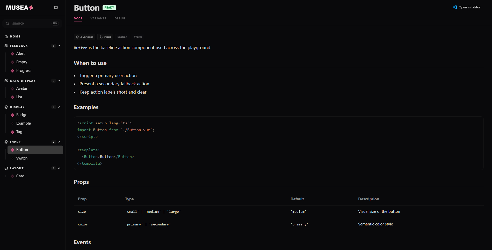

<p align="center" style="margin-top: 2rem;">
    <picture>
      <source media="(prefers-color-scheme: dark)" srcset="https://assets.viyuni.top/viyuni-musea-light.svg">
      <source media="(prefers-color-scheme: light)" srcset="https://assets.viyuni.top/viyuni-musea-dark.svg">
      
    </picture>
</p>

<h1 align="center">Viyuni Musea</h1>

<p align="center">
  <a href="./README.md">English</a> | <a href="./README.zh-CN.md">中文</a>
</p>

<p align="center">
  <a href="https://www.npmjs.com/package/@viyuni/musea">
    
  </a>
  <a href="https://github.com/viyuni/musea/actions/workflows/release.yml">
    
  </a>
  <a href="https://github.com/viyuni/musea/actions/workflows/ci.yml">
    
  </a>
  <a href="./LICENSE">
    
  </a>
  <a href="https://www.npmjs.com/package/@viyuni/musea">
    
  </a>
</p>

<p align="center">
  <strong>一个面向 <code>*.art.vue</code> 文件的轻量 Vue 组件画廊工具，由 <code>musea</code> CLI 驱动。</strong>
</p>

<p align="center">
  <strong> Musea 通过 <code>*.art.vue</code> 让你在一个地方管理组件示例、变体与文档，并提供简单的 CLI 工作流用于开发、构建和预览。 </strong>
</p>

---

<p align="center" style="margin-top: 2rem;">
    <picture>
      <source media="(prefers-color-scheme: dark)" srcset="./img/image-dark.png">
      <source media="(prefers-color-scheme: light)" srcset="./img/image-light.png">
      
    </picture>
</p>

## 安装

```bash
vp add -D @viyuni/musea
```

## 快速开始

在你要展示的组件旁边创建一个 `.art.vue` 文件。

```vue
<template>
  <art
    title="Button"
    status="ready"
    tags="form,action"
    components="./Button.vue"
    docs="./Button.md"
  >
    <variant name="Default" default>
      <Button>Button</Button>
    </variant>
    <variant name="Disabled">
      <Button disabled>Button</Button>
    </variant>
  </art>
</template>

<script setup lang="ts">
import Button from './Button.vue';
</script>
```

启动画廊开发服务：

```bash
vp exec musea dev
```

构建静态产物：

```bash
vp exec musea build
```

预览已构建产物：

```bash
vp exec musea preview
```

## CLI 命令

请在项目根目录执行命令。

当显式传入 CLI 参数时，会覆盖配置文件中的同名配置。

| 命令                    | 说明                     | 可用参数                                           |
| :---------------------- | :----------------------- | :------------------------------------------------- |
| `vp exec musea dev`     | 启动本地开发服务         | `--host <host>`, `--port <port>`                   |
| `vp exec musea build`   | 构建静态组件画廊         | `--outDir <dir>`                                   |
| `vp exec musea preview` | 预览本地构建后的静态画廊 | `--outDir <dir>`, `--host <host>`, `--port <port>` |

说明：

- `musea build ./custom-dir` 是无效用法，请使用 `--outDir`。
- `musea preview` 只会服务已有产物，不会隐式执行构建。

## 配置

Musea 可以从以下位置加载配置：

- `musea.config.*`
- `vite.config.*` 中的 `musea` 字段

`musea.config.ts` 示例：

```ts
import { defineConfig } from '@viyuni/musea';

export default defineConfig({
  patterns: ['src/**/*.art.vue'],
  ignore: ['**/node_modules/**', '**/dist/**'],
  setupFile: 'musea.setup.ts',
  sourceMap: true,
  outDir: '.musea',
  port: 3000,
  host: false,
  vite: {},
});
```

`vite.config.ts` 示例：

```ts
import { defineConfig } from 'vite-plus';

export default defineConfig({
  musea: {
    patterns: ['src/**/*.art.vue'],
  },
});
```

TypeScript 提示：

如果你在 `vite.config.*` 中配置 `musea`，请在该配置对应的 TS Program 中加入 `@viyuni/musea/macro`：

```json
{
  "compilerOptions": {
    "types": ["@viyuni/musea/macro"]
  }
}
```

## `.art.vue` 约定

`<art>` 字段：

- 必填：`title`、`components`、`status`
- 可选：`description`、`docs`、`category`、`tags`、`tests`
- `status` 可选值：`ready`、`wip`、`deprecated`
- `tags` 为逗号分隔字符串
- `components` 与 `tests` 支持：
  - 字符串属性：`components="./Button.vue"`
  - 绑定数组：`:components='["./Button.vue", "./ButtonIcon.vue"]'`

`<variant>` 字段：

- 必填：`name`
- 可选：`default`、`description`

## 构建产物

默认输出目录为 `.musea`。

预期产物包括：

- `.musea/index.html`
- `.musea/frame/variant/index.html`
- `.musea/frame/component/index.html`
- `.musea/assets/*`

## 本地开发（贡献）

本仓库使用 Vite+：

```bash
vp install
vpr typecheck
vp check
vp pack
vp test
```

## 设计参考

Musea 的产品方向与交互体验参考了：

- [Storybook](https://storybook.js.org/)
- [vitejs.dev](https://vitejs.dev/)

组件 API 文档由 [`vue-component-meta`](https://github.com/vuejs/language-tools/tree/master/packages/component-meta) 自动提取（props、events、slots、exposed）。
